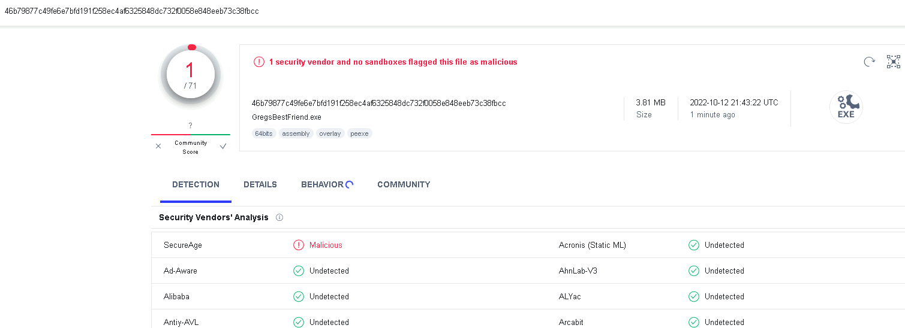

# GregsBestFriend - Bypassing AV/EDR and Building with Different Compilers
GregsBestFriend is a tool designed to bypass AV/EDR systems, and can be built using different compilers to achieve better results. Each compiler produces a different executable, and using different compilers can help break away from using the Microsoft Visual C++ compiler (cl.exe), which is often used and can lead to detections.

## Introduction
GregsBestFriend was created for the [White Knight Labs Offensive Development Course](https://www.antisyphontraining.com/offensive-development-w-greg-hatcher-john-stigerwalt/) to demonstrate how easy it is to bypass AV/EDR systems. The tool serves as a starting point and can be used as a base for developers to build upon. The course creators have shown that GregsBestFriend can be successful in bypassing every AV/EDR system that exists today, provided it is used correctly.

The use of AV and EDR systems is crucial in detecting and preventing malware and other malicious software from infecting a system. However, as demonstrated by GregsBestFriend, these systems can be bypassed if not properly configured or if an attacker has access to a system.

The development of tools like GregsBestFriend highlights the importance of constantly updating and improving AV and EDR systems to ensure their effectiveness against evolving threats. By understanding how these systems can be bypassed, security professionals can better protect against potential attacks and mitigate risks.

## Building with Different Compilers
Different compilers have their own set of optimizations and flags that can be used to tailor the output for specific use cases. By experimenting with different compilers, users can achieve better performance and potentially bypass more AV/EDR systems.

For example, Clang++ provides several optimization flags that can help reduce the size of the compiled code, while GCC (G++) is known for its high-performance optimization capabilities. By using different compilers, users can achieve a unique executable that can evade detection.

Building GregsBestFriend with different compilers ensures that the tool remains versatile and adaptable to different systems and environments. Users can choose the compiler that best suits their needs and build the tool accordingly.

In conclusion, building GregsBestFriend with different compilers allows users to achieve better results in bypassing AV/EDR systems. Each compiler produces a unique executable, which can help evade detection. By using different compilers, users can tailor the output to their specific needs, ensuring the versatility and adaptability of the tool.

## Building

To build GregsBestFriend, follow these steps:

1. Navigate to the appropriate folder for your desired compiler.
2. Follow the instructions provided in the README file to build the tool with your desired compiler.

## Details on the C++ Code

The GregsBestFriend C++ code includes a loop that runs `MAX_OP` times, where `MAX_OP` is defined as a large number. This loop is intended to waste CPU cycles and help prevent sandbox execution. Additionally, the code checks the name of the executable to ensure that it includes the string "GregsBestFriend". This is done to help prevent sandbox execution, as many sandboxes rename the executable when running it.

## VirusTotal Analysis

We do not recommend uploading the final executable to VirusTotal, as this could result in the tool being detected by antivirus software.

Instead, we recommend uploading the tool to [antiscan.me](https://antiscan.me/) or [kleenscan.com](https://kleenscan.com/) for analysis.

Please note that uploading the tool to any online virus scanner or malware analysis service is done at your own risk and could potentially result in your tool being detected by antivirus software.

Below is an example result of uploading GregsBestFriend to VirusTotal (for demonstration purposes only):

## References

- [Different flavors of the Clang compiler for Windows](https://blog.conan.io/2022/10/13/Different-flavors-Clang-compiler-Windows.html)

